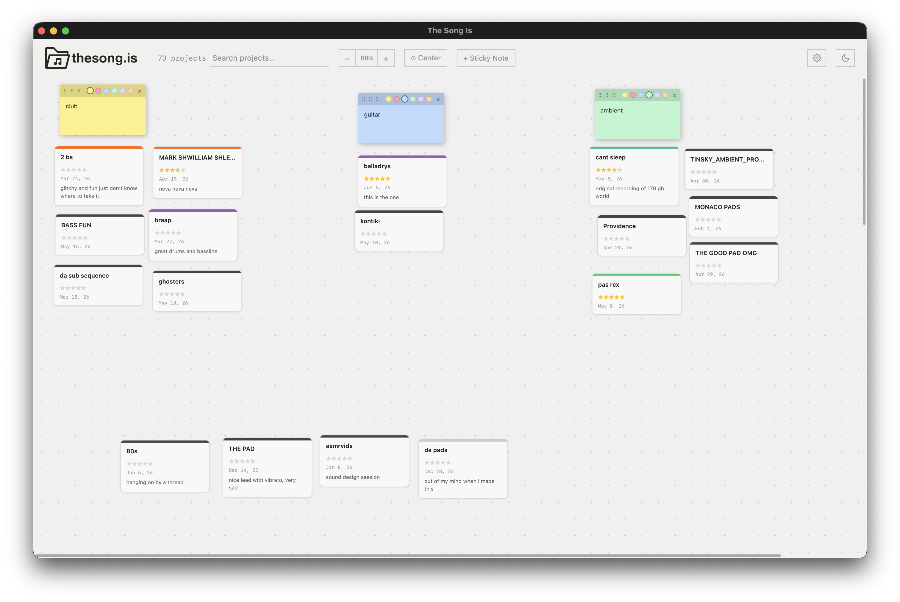
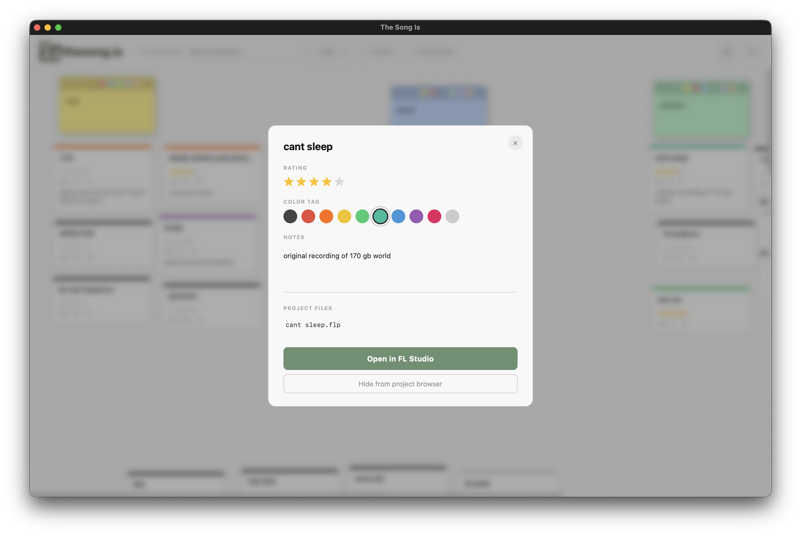

# The Song Is

Visual project browser for music producers, whichever DAW they use.

**[thesong.is](https://thesong.is)**




## Features

- Scan your projects folder, display each project as a draggable card on a canvas. 
- Keep newly discovered projects in an inbox until you drag them onto the canvas
- Navigate large boards with a live, clickable minimap
- Switch between a freeform pin-up board and named Kanban columns
- Filter projects by color, rating, notes or missing project files
- Rate, colour-tag, write notes about each project
- Open projects directly from the app
- Add sticky notes
- Everything persists locally, no account required
- Make a backup and export your data anytime
- Supports FL Studio, Ableton Live, Bitwig Studio, REAPER, Mixcraft Pro Studio,
  LUNA, Logic Pro, GarageBand, Studio One, Cubase, Nuendo, Pro Tools, Reason,
  Cakewalk, Waveform, Ardour, LMMS, Renoise and Adobe Audition

## Running locally

```bash
pip install -r app/requirements.txt
python app/app.py
```

Requires Python 3.9+.

## Building

Builds are produced by GitHub Actions on tag push — see `.github/workflows/release.yml`.
Windows releases are ZIP archives; extract the folder before running the included `.exe`.

## License

GPL v3 — see [LICENSE](LICENSE).
